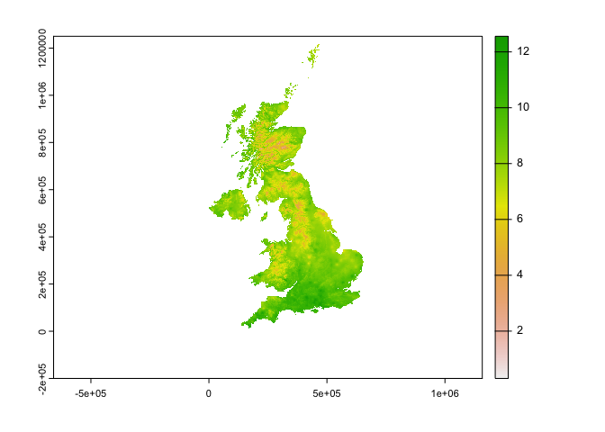
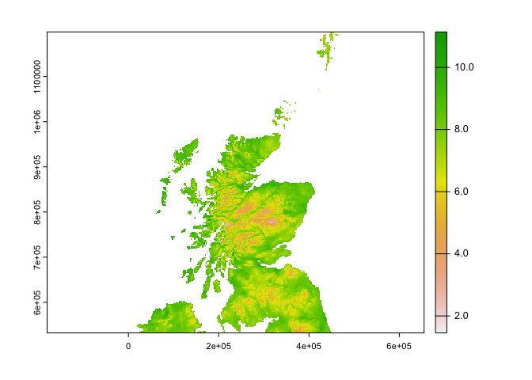
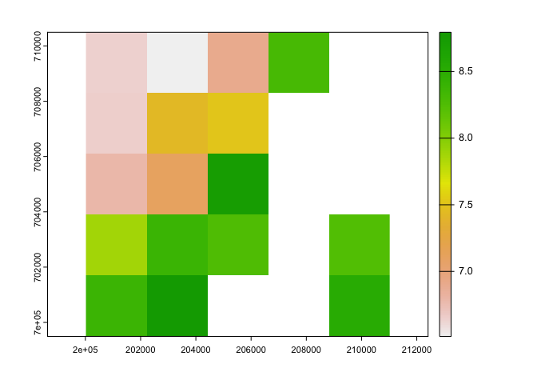
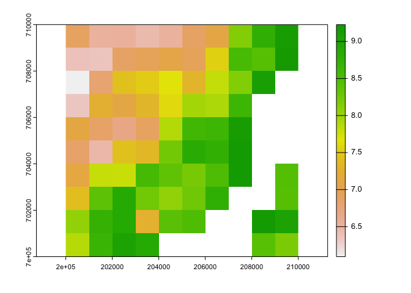

Comparing-Reprojections-HADs
================

``` r
rm(list=ls())

knitr::opts_knit$set(root.dir="/Volumes/vmfileshare/ClimateData/")

library(terra)
library(sp)
library(exactextractr)

dd <- "/Volumes/vmfileshare/ClimateData/"
```

## **0. About**

Bias correction techniques in general require observational data to
compare with climate projections in order to appropriately correct the
bias.

The [HadUK
grid](https://catalogue.ceda.ac.uk/uuid/bbca3267dc7d4219af484976734c9527)
is a 1km x 1km gridded dataset derived from meterological station
observations.

The first UKCP product for review is the UCKP convection-permitting
dataset, on a 2.2km grid. Therefore, we are resmapling the 1km grid
using bilenear interpolation to 2.2km grid extent.

We have ran this seperately in both `r` and `python`. The aim of this
doc is to:

-   Ensure both methods produce the same result
-   Ensure the grid has been resampled to the correct extent and CRS

## **1. Data**

### **1a. HadUK grid resampled in R**

    Resampling script [here](https://github.com/alan-turing-institute/clim-recal/blob/main/R/Resampling.HADs.inR.R)
    The 2.2km grid was derived from a reprojected (to BNG) UKCP 2.2km .nc file

In resampling it resampled the Sea as xx so replacing those vals as NA

``` r
r1 <- paste0(dd,"TestData.R-python/Resampled_HADs_tasmax.2000.01.tif")
r1 <- rast(r1)#Contains 31 layers for each day of Jan

#In the resampling, the method used seemed to have relable all Sea values as '1.000000e+20' so relabelling them here (but to be checked as to why they've been valued like this in the resampling)
r1[r1 > 200] = NA

#check the crs
crs(r1, proj=T)
```

    ## [1] "+proj=tmerc +lat_0=49 +lon_0=-2 +k=0.9996012717 +x_0=400000 +y_0=-100000 +a=6377563.396 +rf=299.324961266495 +units=m +no_defs"

``` r
#Plot to check
plot(r1$tasmax_1)
```

<!-- -->

### **1b. HadUK grid resampled in python**

Resampling script
[here](https://github.com/alan-turing-institute/clim-recal/blob/main/python/resampling/resampling_hads.py)

``` r
py.pros.tasmax <- list.files(paste0(dd, "Processed/HadsUKgrid/resampled_2.2km/tasmax/day"))
r2 <- py.pros.tasmax[grepl("200001", py.pros.tasmax)] #Same file as resampled above
r2 <- paste0(paste0(dd, "Processed/HadsUKgrid/resampled_2.2km/tasmax/day"),"/",r2)
r2 <- rast(r2)
crs(r2) #check crs 
```

    ## [1] ""

``` r
## Ok so interesting is missing a crs slot on read - I wonder why this is? This could cause future problem potentially? 

plot(r2$tasmax_1)
```

<!-- -->

### **1c. Original HADUK grid**

``` r
f <- paste0(dd, "Raw/HadsUKgrid/tasmax/day/")
hads.tasmax <- list.files(f)

hads.tasmax2 <- hads.tasmax[grepl("200001", hads.tasmax )] #Same file as resampled above
og <- paste0(f, hads.tasmax2)

og <- rast(og)
crs(og, proj=T)
```

    ## [1] "+proj=tmerc +lat_0=49 +lon_0=-2 +k=0.9996012717 +x_0=400000 +y_0=-100000 +a=6377563.396 +rf=299.324961266495 +units=m +no_defs"

``` r
plot(og$tasmax_1)
```

<!-- -->
\### **1d. UKCP example**

For comparing the grids

``` r
f <- paste0(dd,"Processed/UKCP2.2_Reproj/tasmax_bng2/01/latest/tasmax_rcp85_land-cpm_uk_2.2km_01_day_19991201-20001130.tif")
ukcp <- rast(f)
ukcp.r <- ukcp$`tasmax_rcp85_land-cpm_uk_2.2km_01_day_19991201-20001130_31`

crs(ukcp.r, proj=T)
```

    ## [1] "+proj=tmerc +lat_0=49 +lon_0=-2 +k=0.9996012717 +x_0=400000 +y_0=-100000 +ellps=airy +units=m +no_defs"

``` r
#plot(ukcp.r)
```

### **1e. Cropped extent**

Just comparing by cropping to Scotland (bbox created
[here](https://github.com/alan-turing-institute/clim-recal/tree/main/data/Scotland))

``` r
scotland <- vect("~/Library/CloudStorage/OneDrive-TheAlanTuringInstitute/CLIM-RECAL/clim-recal/data/Scotland/Scotland.bbox.shp")
```

## **2. Comparisons **

Crop extents to be the same

``` r
#Noticed the crop takes longer on r2_c - for investigation!

b <- Sys.time()
r1_c <- terra::crop(r1, scotland, snap="in") 
e <- Sys.time()
e-b
```

    ## Time difference of 0.02500701 secs

``` r
plot(r1_c$tasmax_1)
```

<!-- -->

``` r
b <- Sys.time()
r2_c <- terra::crop(r2, scotland, snap="in") 
e <- Sys.time()
e-b
```

    ## Time difference of 30.27387 secs

``` r
plot(r2_c$tasmax_1)
```

<!-- -->

``` r
og_c <- terra::crop(og, scotland, snap="in") 
plot(og_c$tasmax_1)
```

<!-- -->
Ok there are some differences that I can see from the plot between the
two resampled files!

``` r
## Cropping to a small area to compare with the same orginal HADS file 
i <- rast()
ext(i) <- c(200000, 210000, 700000, 710000)

r1_ci <- crop(r1_c, i)
plot(r1_ci$tasmax_1)
```

<!-- -->

``` r
#Get number of cells in cropped extent
cells <- cells(r1_ci)

#get coords for all cells (for comparing above)
r.reproj_c_xy <- sapply(cells, function(i){xyFromCell(r1_ci, i)})

r.reproj_c_xy
```

    ##          [,1]     [,2]     [,3]     [,4]     [,5]     [,6]     [,7]     [,8]
    ## [1,] 200935.7 203135.7 205335.7 207535.7 209735.7 200935.7 203135.7 205335.7
    ## [2,] 709531.7 709531.7 709531.7 709531.7 709531.7 707331.7 707331.7 707331.7
    ##          [,9]    [,10]    [,11]    [,12]    [,13]    [,14]    [,15]    [,16]
    ## [1,] 207535.7 200935.7 203135.7 205335.7 207535.7 200935.7 203135.7 205335.7
    ## [2,] 707331.7 705131.7 705131.7 705131.7 705131.7 702931.7 702931.7 702931.7
    ##         [,17]    [,18]    [,19]    [,20]
    ## [1,] 209735.7 200935.7 203135.7 209735.7
    ## [2,] 702931.7 700731.7 700731.7 700731.7

``` r
r2_ci <- crop(r2_c, i)
plot(r2_ci$tasmax_1)
```

<!-- -->

``` r
og_ci <- crop(og_c, i)
plot(og_ci$tasmax_1)
```

<!-- -->

``` r
ukcp_c <- terra::crop(ukcp.r, i) 
plot(ukcp_c$`tasmax_rcp85_land-cpm_uk_2.2km_01_day_19991201-20001130_31`)
```

<!-- -->

``` r
#Get number of cells in cropped extent
cells <- cells(ukcp_c)

#get coords for all cells (for comparing above)
ukcp_c_xy <- sapply(cells, function(i){xyFromCell(ukcp_c, i)})

ukcp_c_xy
```

    ##          [,1]     [,2]     [,3]     [,4]     [,5]     [,6]     [,7]     [,8]
    ## [1,] 200935.7 203135.7 205335.7 207535.7 209735.7 200935.7 203135.7 205335.7
    ## [2,] 709531.7 709531.7 709531.7 709531.7 709531.7 707331.7 707331.7 707331.7
    ##          [,9]    [,10]    [,11]    [,12]    [,13]    [,14]    [,15]    [,16]
    ## [1,] 207535.7 209735.7 200935.7 203135.7 205335.7 207535.7 209735.7 200935.7
    ## [2,] 707331.7 707331.7 705131.7 705131.7 705131.7 705131.7 705131.7 702931.7
    ##         [,17]    [,18]    [,19]    [,20]    [,21]    [,22]    [,23]    [,24]
    ## [1,] 203135.7 205335.7 207535.7 209735.7 200935.7 203135.7 205335.7 207535.7
    ## [2,] 702931.7 702931.7 702931.7 702931.7 700731.7 700731.7 700731.7 700731.7
    ##         [,25]
    ## [1,] 209735.7
    ## [2,] 700731.7

``` r
all(ukcp_c_xy, r.reproj_c_xy)
```

    ## Warning in all(ukcp_c_xy, r.reproj_c_xy): coercing argument of type 'double' to
    ## logical

    ## Warning in all(ukcp_c_xy, r.reproj_c_xy): coercing argument of type 'double' to
    ## logical

    ## [1] TRUE
