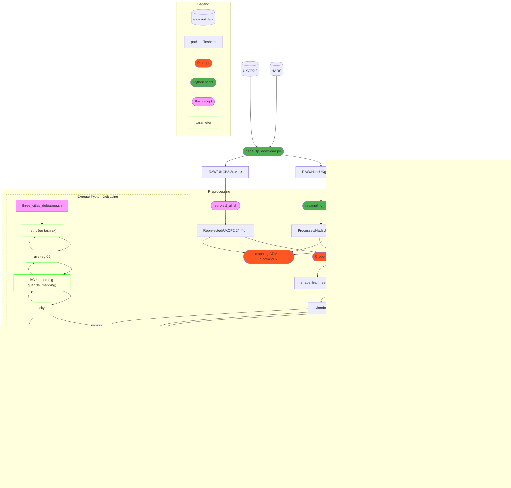

```mermaid

graph TB

subgraph Legend
    data_external[(external data)]
    data_fileshare[path to fileshare]
    script_r([R script])
    script_py([Python script])
    script_bash([Bash script])
    var[parameter]:::var
end

data_hads[(HADS)]
data_cpm[(UKCP2.2)]
data_shape_uk[(shapefile UK)]
data_shape_cities[(shapefile cities)]

script_load([ceda_ftp_download.py])

data_hads_raw[RAW/HadsUKgrid/../*.nc]
data_cpm_raw[RAW/UKCP2.2/../*.nc]
data_hads --> script_load
data_cpm --> script_load
script_load --> data_hads_raw
script_load --> data_cpm_raw
data_hads_raw --> script_resampling
data_cpm_raw --> script_reproject

data_shape_uk --> script_crop_uk
data_shape_cities --> script_crop_city

subgraph Preprocessing
    
    script_resampling([resampling_hads.py])
    script_reproject([reproject_all.sh])  
    script_preproc([preprocess_data.py])
    script_crop_uk([cropping-CPM-to-Scotland.R])
    script_crop_city([Cropping_Rasters_to_three_cities.R])
    
    data_hads_res[Processed/HadsUKgrid/../*.nc]
    data_cpm_rep[Reprojected/UKCP2.2/../*.tiff]

    data_cropped[Cropped/three.cities/..]
    data_gl[../glasgow]
    data_ma[../manchester]
    data_lon[../london]
    data_outdir[Cropped/three.cities/preprocessed/..]
    data_out_train[../simh..]
    data_out_validate[../simp..]
    data_out_groundtruth_h[../obsh..]
    data_out_groundtruth_p[../obsp..]
    data_out3[out]
    data_out3[out]
    
    script_resampling --> data_hads_res
    script_reproject --> data_cpm_rep
    
    data_hads_res --> script_crop_uk
    data_hads_res --> script_crop_city

    script_crop_city --> data_cropped
    script_crop_city --> data_shapefile_cities[shapefiles/three.cities]
    data_cropped --> data_gl
    data_cropped --> data_ma
    data_cropped --> data_lon


    data_gl --> script_preproc
    data_ma --> script_preproc
    data_lon --> script_preproc
    script_preproc --> data_outdir
    data_outdir --> data_out_train
    data_outdir --> data_out_validate
    data_outdir --> data_out_groundtruth
    script_crop_uk --> data_out3
    
    data_cpm_rep --> script_crop_city
    data_cpm_rep --> script_crop_uk
    
        subgraph innerSubgraph[Execute Python Debiasing]
        script_BC_wrapper[three_cities_debiasing.sh]
        param1["metric (eg tasmax)"]:::var
        param2["runs (eg 05)"]:::var
        param3["BC method (eg quantile_mapping)"]:::var
        param4[city]:::var

        script_BC_wrapper --> param1
        param1 --> param2
        param2 --> param3
        param3 --> param4
        param4 -- for loop --> script_preproc

        %% Looping connections
        param4 -.-> param3
        param3 -.-> param2
        param2 -.-> param1
    end
    
end


subgraph assessment
    script_asses[tbc]
    data_out_groundtruth_p --> script_asses
end


subgraph Debiasing
    param4 -- for loop --> script_bc_py

    
    script_bc_py([run_cmethods.py])
    data_out[Debiased/three.cities.cropped]
    data_out --> script_asses
    script_bc_r([apply_qmapQuant_to_crpd_df_fn.R])
    
    data_out_train --> script_bc_py
    data_out_train --> script_bc_py
    data_out_groundtruth --> script_bc_py
    
    script_bc_py-->data_out
    
    
    data_gl --> script_bc_r
    data_ma --> script_bc_r
    data_lon --> script_bc_r
    data_out3 --> script_bc_r

end


classDef python fill:#4CAF50;
classDef r fill:#FF5722;
classDef bash fill:#f9f
classDef var fill:none,stroke:#0f0;
classDef dashed stroke-dasharray: 5 5; 

class script_crop_city,script_crop_uk,script_bc_r,script_r r;
class script_load,script_resampling,script_preproc,script_bc_py,script_py python;
class script_reproject,script_BC_wrapper,script_bash bash;
class innerSubgraph dashed;
```
