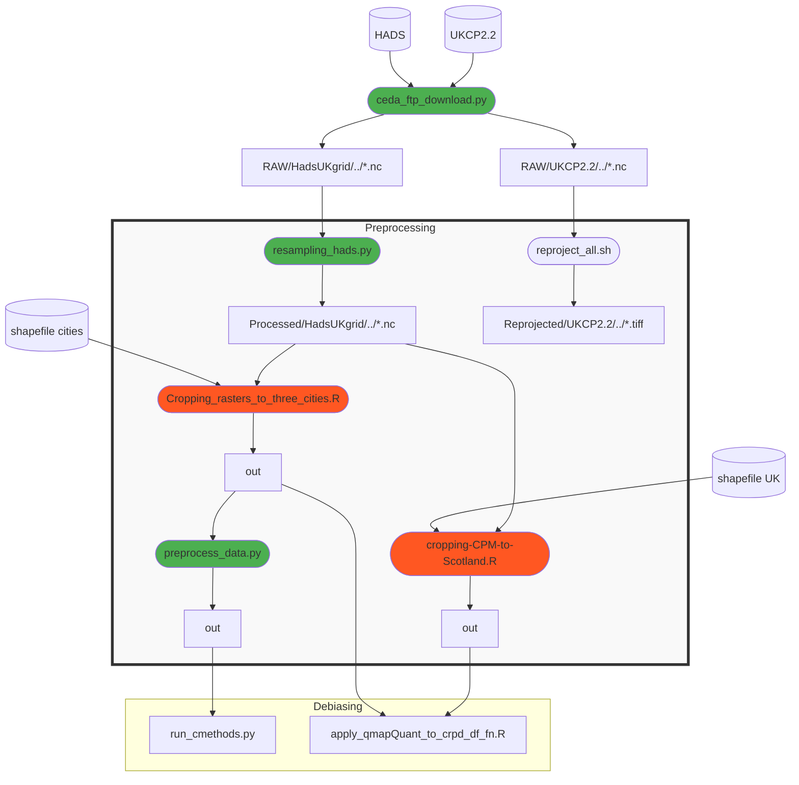

```mermaid

graph TD

data_hads[(HADS)]
data_cpm[(UKCP2.2)]
data_shape_uk[(shapefile UK)]
data_shape_cities[(shapefile cities)]

script_load([ceda_ftp_download.py])

data_hads_raw[RAW/HadsUKgrid/../*.nc]
data_cpm_raw[RAW/UKCP2.2/../*.nc]
data_hads --> script_load
data_cpm --> script_load
script_load --> data_hads_raw
script_load --> data_cpm_raw
data_hads_raw --> script_resampling
data_cpm_raw --> script_reproject

data_shape_uk --> script_crop_uk
data_shape_cities --> script_crop_city

subgraph Preprocessing
    style Preprocessing fill:#f9f9f9,stroke:#333,stroke-width:4px
    
    script_resampling([resampling_hads.py])
    script_reproject([reproject_all.sh])  
    script_preproc([preprocess_data.py])
    script_crop_uk([cropping-CPM-to-Scotland.R])
    script_crop_city([Cropping_rasters_to_three_cities.R])
    
    data_hads_res[Processed/HadsUKgrid/../*.nc]
    data_cpm_rep[Reprojected/UKCP2.2/../*.tiff]
    data_out1[out]
    data_out2[out]
    data_out3[out]
    
    script_resampling --> data_hads_res
    script_reproject --> data_cpm_rep
    
    data_hads_res --> script_crop_uk
    data_hads_res --> script_crop_city

    
    script_crop_city --> data_out1
    data_out1 --> script_preproc
    script_preproc --> data_out2
    script_crop_uk --> data_out3
    

end


subgraph Debiasing
    
    script_bc_py[run_cmethods.py]
    script_bc_r[apply_qmapQuant_to_crpd_df_fn.R]
    
    data_out2 --> script_bc_py
    data_out1 --> script_bc_r
    data_out3 --> script_bc_r
    
end


classDef python fill:#4CAF50;
classDef r fill:#FF5722;

class script_crop_city,script_crop_uk r;
class script_load,script_resampling,script_preproc python;

```
