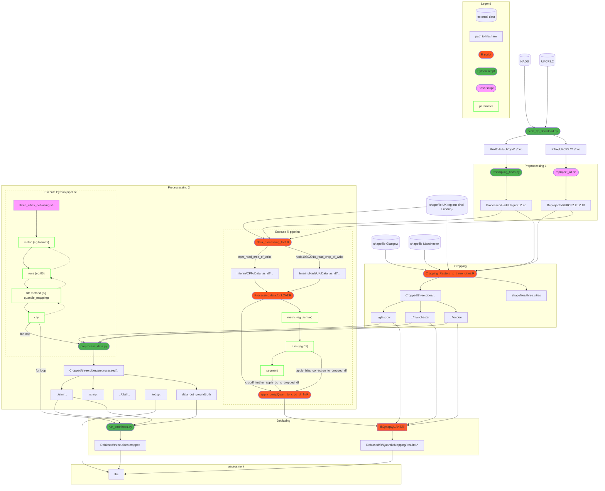

```mermaid

graph TB

subgraph Legend
    data_external[(external data)]
    data_fileshare[path to fileshare]
    script_r([R script])
    script_py([Python script])
    script_bash([Bash script])
    var[parameter]:::var
end

data_hads[(HADS)]
data_cpm[(UKCP2.2)]
data_shape_uk[("shapefile UK regions (incl London)")]
data_shape_gl[(shapefile Glasgow)]
data_shape_ma[(shapefile Manchester)]

script_load([ceda_ftp_download.py])

data_hads_raw[RAW/HadsUKgrid/../*.nc]
data_cpm_raw[RAW/UKCP2.2/../*.nc]
data_hads --> script_load
data_cpm --> script_load
script_load --> data_hads_raw
script_load --> data_cpm_raw


subgraph Preprocessing 1
    
    script_resampling([resampling_hads.py])
    script_reproject([reproject_all.sh])  
    
    data_hads_res[Processed/HadsUKgrid/../*.nc]
    data_cpm_rep[Reprojected/UKCP2.2/../*.tiff]

    
    script_resampling --> data_hads_res
    script_reproject --> data_cpm_rep
end

subgraph Cropping

    script_crop_city([Cropping_Rasters_to_three_cities.R])
    
    data_cropped[Cropped/three.cities/..]
    data_gl[../glasgow]
    data_ma[../manchester]
    data_lon[../london]
    data_shapefile_cities[shapefiles/three.cities]
    
    script_crop_city --> data_cropped
    script_crop_city --> data_shapefile_cities
    data_cropped --> data_gl
    data_cropped --> data_ma
    data_cropped --> data_lon
    
end

subgraph Preprocessing 2
    data_outdir[Cropped/three.cities/preprocessed/..]

    script_preproc([preprocess_data.py])
    
    data_out_train[../simh..]
    data_out_validate[../simp..]
    data_out_groundtruth_h[../obsh..]
    data_out_groundtruth_p[../obsp..]
    
    script_preproc --> data_outdir

    data_outdir --> data_out_train
    data_outdir --> data_out_validate
    data_outdir --> data_out_groundtruth


    subgraph inner_py[Execute Python pipeline]
        
        script_BC_wrapper[three_cities_debiasing.sh]
        param1["metric (eg tasmax)"]:::var
        param2["runs (eg 05)"]:::var
        param3["BC method (eg quantile_mapping)"]:::var
        param4[city]:::var

        script_BC_wrapper --> param1
        param1 --> param2
        param2 --> param3
        param3 --> param4
        param4 -- for loop --> script_preproc

        %% Looping connections
        param4 -.-> param3
        param3 -.-> param2
        param2 -.-> param1
    end
    
    subgraph inner_r[Execute R pipeline]
    
        script_crop_uk([Data_processing_todf.R])
        script_df_uk([Processing.data.for.LCAT.R])
        param1_r["metric (eg tasmax)"]:::var
        param2_r["runs (eg 05)"]:::var
        param3_r["segment"]:::var
        
        fn_bc([apply_qmapQuant_to_crpd_df_fn.R])
        data_interim_hads[Interim/HadsUK/Data_as_df/...]
        data_interim_cpm[Interim/CPM/Data_as_df/...]
        
        script_crop_uk -- cpm_read_crop_df_write --> data_interim_cpm
        script_crop_uk -- hads19802010_read_crop_df_write --> data_interim_hads
        data_interim_cpm --> script_df_uk
        data_interim_hads --> script_df_uk

        script_df_uk-->fn_bc
        
               
        script_df_uk--> param1_r
        param1_r --> param2_r
        param2_r --> param3_r
        param2_r -- apply_bias_correction_to_cropped_df --> fn_bc
        param3_r -- cropdf_further_apply_bc_to_cropped_df --> fn_bc
        
    end
end

subgraph assessment
    script_asses[tbc]
    data_out_groundtruth_p --> script_asses
end

subgraph Debiasing
    script_bc_py([run_cmethods.py])
    script_bc_r[[fitQmapQUANT.R]]

    
    data_out_py[Debiased/three.cities.cropped]
    data_out_r[Debiased/R/QuantileMapping/resultsL*]
    data_out_py --> script_asses
    data_out_r --> script_asses
    
    data_out_train --> script_bc_py
    data_out_train --> script_bc_py
    data_out_groundtruth --> script_bc_py
    
    script_bc_py-->data_out_py
    script_bc_r-->data_out_r
end

%% between block connections
%% input preproc 1
data_hads_raw --> script_resampling
data_cpm_raw --> script_reproject
%% input cropping
data_cpm_rep --> script_crop_city
    
data_hads_res --> script_crop_uk
data_hads_res --> script_crop_city
data_shape_uk --> script_crop_city
data_shape_ma --> script_crop_city
data_shape_gl --> script_crop_city

%% input preproc2
data_cpm_rep --> script_crop_uk
data_shape_uk --> script_crop_uk
data_gl --> script_preproc
data_ma --> script_preproc
data_lon --> script_preproc
%% input debiasing
fn_bc --> script_bc_r
data_gl --> script_bc_r
data_ma --> script_bc_r
data_lon --> script_bc_r
param4 -- for loop --> script_bc_py


%% class styles
classDef python fill:#4CAF50;
classDef r fill:#FF5722;
classDef bash fill:#f9f
classDef var fill:none,stroke:#0f0;
classDef dashed stroke-dasharray: 5 5; 

class script_crop_city,script_crop_uk,script_bc_r,script_r,script_df_uk,function_bc,function_crop_bc,fn_crop_cpm,fn_crop_hads,fn_bc r;
class script_load,script_resampling,script_preproc,script_bc_py,script_py python;
class script_reproject,script_BC_wrapper,script_bash bash;
class inner_py dashed;
class inner_r dashed;
```

